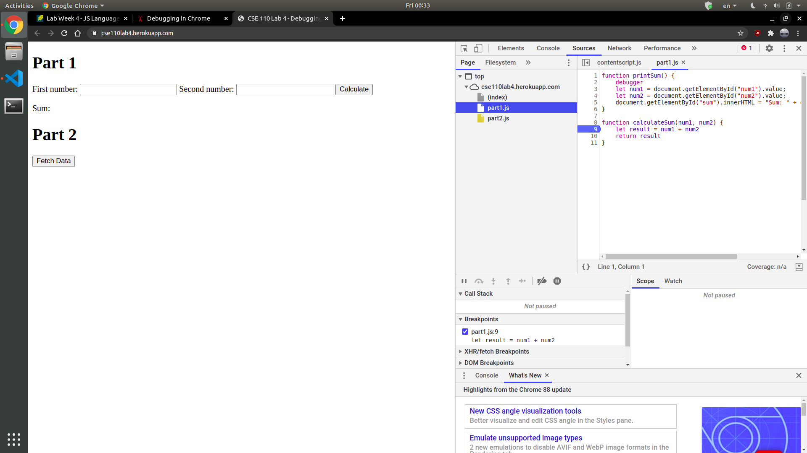

# Debugging:

- Breakpoint screenshot:

- Watch expressions list screenshot:

- Bugfix screenshot:

# Network tab:

1. `citylots.json`
2. `part2.js`
3. 11.7 MB
4. 74 ms
5. The user agent was:
   > Mozilla/5.0 (X11; Linux x86_64) AppleWebKit/537.36 (KHTML, like Gecko) Chrome/88.0.4324.96 Safari/537.36
6. Apache
7. The file was last modified on:
   > Tue, 26 Jan 2021 22:14:13 GMT
8. `application/json`.
9. `fetchData`
